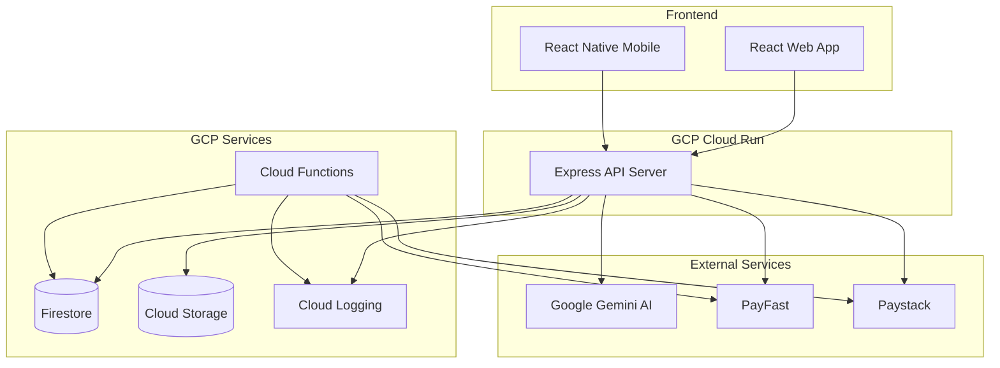

# CAPS360 Platform Architecture

## System Overview

CAPS360 is a cloud-native, AI-powered educational platform built on Google Cloud Platform (GCP) with a microservices architecture.



## Architecture Components

### Frontend Layer

#### Web Application (React + Vite)
- **Framework**: React 18 with TypeScript
- **Build Tool**: Vite for fast development and optimized production builds
- **Styling**: TailwindCSS with custom CAPS360 brand theme
- **State Management**: Zustand for global state, TanStack Query for server state
- **Routing**: React Router v6
- **UI Components**: Radix UI primitives for accessibility

#### Mobile Application (React Native + Expo)
- **Framework**: React Native with Expo
- **Navigation**: React Navigation
- **State Management**: Shared with web (Zustand)
- **Offline Support**: AsyncStorage for local data persistence

### Backend Layer

#### API Server (Node.js + Express)
- **Runtime**: Node.js 18+
- **Framework**: Express with TypeScript
- **Hosting**: Google Cloud Run (containerized, auto-scaling)
- **Authentication**: JWT-based with bcrypt password hashing
- **Validation**: express-validator for input validation
- **Rate Limiting**: express-rate-limit with tier-specific limits

#### Services Architecture

**Authentication Service**
- User registration and login
- JWT token generation and verification
- Password hashing with bcrypt
- Session management

**Subscription Service**
- Trial and welcome premium logic
- Tier-based access control
- Subscription lifecycle management
- Upgrade/downgrade handling

**Payment Service**
- PayFast integration for trial payment capture
- Paystack integration for recurring subscriptions
- Webhook signature verification
- Payment record tracking

**AI Service**
- Gemini 1.5 Flash integration
- Response caching with node-cache
- Cost optimization through caching
- Context-aware conversation management

**Content Service**
- Course and lesson management
- Cloud Storage integration
- Signed URL generation for secure media access
- Tier-based content filtering

**Analytics Service**
- Event tracking and aggregation
- User behavior analytics
- Revenue reporting
- Admin dashboard data

### Data Layer

#### Firestore Collections

**users**
```typescript
{
  id: string
  email: string
  passwordHash: string
  firstName: string
  lastName: string
  role: 'student' | 'teacher' | 'parent' | 'admin'
  currentTier: 'study_help' | 'standard' | 'premium'
  trialPremium: boolean
  trialEndDate?: Date
  welcomePremium: boolean
  welcomePremiumEndDate?: Date
  createdAt: Date
  updatedAt: Date
}
```

**subscriptions**
```typescript
{
  id: string
  userId: string
  tier: 'study_help' | 'standard' | 'premium'
  status: 'active' | 'cancelled' | 'expired'
  paymentProvider: 'payfast' | 'paystack'
  paystackSubscriptionId?: string
  amount: number
  billingCycle: 'monthly' | 'annual'
  startDate: Date
  nextBillingDate?: Date
}
```

**courses, lessons, quizzes, analytics, ai_conversations, payments**

### Cloud Functions

**trial-expiry-checker** (Scheduled: Daily)
- Checks for expired trials
- Sends payment reminders
- Updates user status

**welcome-premium-expiry** (Scheduled: Daily)
- Checks for expired welcome premium periods
- Reverts users to purchased tier

**payfast-webhook** (HTTP Trigger)
- Handles PayFast payment notifications
- Verifies signatures
- Updates payment status

**paystack-webhook** (HTTP Trigger)
- Handles Paystack subscription events
- Processes recurring payments

**notification-service** (Pub/Sub Trigger)
- Sends emails and push notifications
- In-app messaging

## Subscription & Trial Logic

### Free Trial Flow
1. User signs up → chooses "Start Free Trial"
2. `trialPremium = true`, `trialEndDate = now + 14 days`
3. User has full Premium access for 14 days
4. After 14 days, Cloud Function triggers payment prompt
5. If payment succeeds → convert to paid subscription
6. If payment fails → downgrade to Study Help tier

### Welcome Premium Flow
1. User signs up → chooses "Choose a Plan" → pays immediately
2. Paystack subscription created
3. `welcomePremium = true`, `welcomePremiumEndDate = now + 14 days`
4. User has Premium features for 14 days
5. After 14 days → `welcomePremium = false` → revert to purchased tier

### Effective Tier Calculation
```typescript
function getEffectiveTier(user: User): Tier {
  if (user.trialPremium && user.trialEndDate > now) return 'premium'
  if (user.welcomePremium && user.welcomePremiumEndDate > now) return 'premium'
  return user.currentTier
}
```

## Payment Integration

### PayFast (Trial Payment Capture)
- Used for deferred trial payments
- ITN (Instant Transaction Notification) webhook
- MD5 signature verification
- One-time payment processing

### Paystack (Recurring Subscriptions)
- Used for monthly/annual subscriptions
- Subscription plans for each tier
- Webhook events: subscription.create, charge.success, subscription.disable
- HMAC SHA512 signature verification

## AI Integration

### Google Gemini 1.5 Flash
- **Model**: gemini-1.5-flash (cost-effective)
- **Features**:
  - AI Tutor Chat with conversation history
  - Quiz generation from lesson content
  - Assignment grading with feedback
  - Lesson plan generation for teachers
- **Optimization**:
  - Response caching (1 hour TTL)
  - Context window management
  - Usage tracking for cost monitoring

## Security

- **Authentication**: JWT tokens with secure secret
- **Password Hashing**: bcrypt with salt rounds
- **API Rate Limiting**: Tier-specific limits
- **Input Validation**: express-validator on all endpoints
- **CORS**: Configured for frontend domains only
- **Helmet**: Security headers
- **Webhook Verification**: Signature validation for all webhooks
- **Secrets Management**: GCP Secret Manager

## Monitoring & Logging

- **Cloud Logging**: All API requests and errors
- **Cloud Monitoring**: API latency, error rates, resource usage
- **Custom Metrics**: AI usage, subscription conversions, revenue
- **Alerts**: High error rates, payment failures, trial expirations

## Deployment

### Backend (Cloud Run)
- Containerized with Docker
- Auto-scaling based on traffic
- Health check endpoint: `/health`
- Environment variables from Secret Manager

### Frontend Web
- Static hosting (Firebase Hosting, Vercel, or Netlify)
- CDN distribution
- Environment-specific builds

### Frontend Mobile
- Expo EAS Build
- Over-the-air updates
- App Store & Google Play deployment

## Scalability

- **Horizontal Scaling**: Cloud Run auto-scales based on requests
- **Database**: Firestore scales automatically
- **Caching**: AI responses cached to reduce costs
- **CDN**: Static assets served from Cloud Storage with CDN
- **Rate Limiting**: Prevents abuse and ensures fair usage
