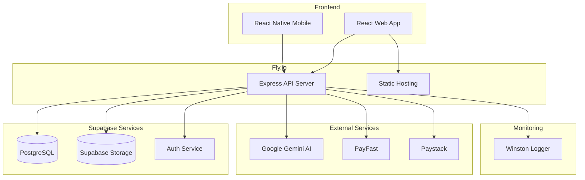

# CAPS360 Platform Architecture

## System Overview

CAPS360 is a cloud-native, AI-powered educational platform built on Fly.io for hosting and Supabase for database and storage services.



## Architecture Components

### Frontend Layer

#### Web Application (React + Vite)

- **Framework**: React 18 with TypeScript
- **Build Tool**: Vite for fast development and optimized production builds
- **Styling**: TailwindCSS with custom CAPS360 brand theme
- **State Management**: Zustand for global state, TanStack Query for server state
- **Routing**: React Router v6
- **UI Components**: Radix UI primitives for accessibility
- **Hosting**: Fly.io Static Hosting (nginx-based)

#### Mobile Application (React Native + Expo)

- **Framework**: React Native with Expo
- **Navigation**: React Navigation
- **State Management**: Shared with web (Zustand)
- **Offline Support**: AsyncStorage for local data persistence

### Backend Layer

#### API Server (Node.js + Express)

- **Runtime**: Node.js 18+
- **Framework**: Express with TypeScript
- **Hosting**: Fly.io (containerized, auto-scaling)
- **Authentication**: Supabase Auth + JWT-based with bcrypt password hashing
- **Validation**: express-validator for input validation
- **Rate Limiting**: express-rate-limit with tier-specific limits

#### Services Architecture

**Authentication Service**

- User registration and login (Supabase Auth)
- JWT token generation and verification
- Password hashing with bcrypt
- Session management

**Subscription Service**

- Trial and welcome premium logic
- Tier-based access control
- Subscription lifecycle management
- Upgrade/downgrade handling

**Payment Service**

- PayFast integration for trial payment capture
- Paystack integration for recurring subscriptions
- Webhook signature verification
- Payment record tracking

**AI Service**

- Gemini 1.5 Flash integration
- Response caching with node-cache
- Cost optimization through caching
- Context-aware conversation management

**Content Service**

- Course and lesson management
- Supabase Storage integration
- Signed URL generation for secure media access
- Tier-based content filtering

**Analytics Service**

- Event tracking and aggregation in Supabase
- User behavior analytics
- Revenue reporting
- Admin dashboard data

### Data Layer

#### Supabase Tables

**users**

- All user profile data and subscription status

**subscriptions**

- Active and past subscription records

**courses, lessons, quizzes, analytics, ai_conversations, payments**

### Features

**Trial & Welcome Premium Expiry**

- Background workers or API logic handles expiry (migrated from Cloud Functions)

**Webhooks**

- PayFast and Paystack webhooks processed directly by the API server

**Notification Service**

- Integrated within the main API for email and messaging

## Subscription & Trial Logic

### Free Trial Flow

1. User signs up → chooses "Start Free Trial"
2. `trialPremium = true`, `trialEndDate = now + 14 days`
3. User has full Premium access for 14 days
4. After 14 days, background worker triggers payment prompt
5. If payment succeeds → convert to paid subscription
6. If payment fails → downgrade to Study Help tier

### Welcome Premium Flow

1. User signs up → chooses "Choose a Plan" → pays immediately
2. Paystack subscription created
3. `welcomePremium = true`, `welcomePremiumEndDate = now + 14 days`
4. User has Premium features for 14 days
5. After 14 days → `welcomePremium = false` → revert to purchased tier

### Effective Tier Calculation

```typescript
function getEffectiveTier(user: User): Tier {
  if (user.trialPremium && user.trialEndDate > now) return 'premium'
  if (user.welcomePremium && user.welcomePremiumEndDate > now) return 'premium'
  return user.currentTier
}
```

## Payment Integration

### PayFast (Trial Payment Capture)

- Used for deferred trial payments
- ITN (Instant Transaction Notification) webhook
- MD5 signature verification
- One-time payment processing

### Paystack (Recurring Subscriptions)

- Used for monthly/annual subscriptions
- Subscription plans for each tier
- Webhook events: subscription.create, charge.success, subscription.disable
- HMAC SHA512 signature verification

## AI Integration

### Google Gemini 1.5 Flash

- **Model**: gemini-1.5-flash (cost-effective)
- **Features**:
  - AI Tutor Chat with conversation history
  - Quiz generation from lesson content
  - Assignment grading with feedback
  - Lesson plan generation for teachers
- **Optimization**:
  - Response caching (1 hour TTL)
  - Context window management
  - Usage tracking for cost monitoring

## Security

- **Authentication**: JWT tokens + Supabase Auth
- **Password Hashing**: bcrypt with salt rounds
- **API Rate Limiting**: Tier-specific limits
- **Input Validation**: express-validator on all endpoints
- **CORS**: Configured for frontend domains only
- **Helmet**: Security headers
- **Webhook Verification**: Signature validation for all webhooks
- **Secrets Management**: Fly.io Secrets

## Monitoring & Logging

- **Winston Logger**: All API requests and errors logged to stdout
- **Fly.io Monitoring**: Resource usage and health checks
- **Custom Metrics**: AI usage, subscription conversions, revenue

## Deployment

### Backend (Fly.io)

- Containerized with Docker
- Auto-scaling or fixed scaling options
- Health check endpoint: `/health`
- Environment variables from Fly.io secrets

### Frontend Web

- Static hosting on Fly.io (nginx)
- CDN distribution via global Fly network
- Environment-specific builds

### Frontend Mobile

- Expo EAS Build
- Over-the-air updates
- App Store & Google Play deployment

## Scalability

- **Horizontal Scaling**: Fly.io scale options
- **Database**: Supabase (PostgreSQL) scales with your plan
- **Caching**: AI responses cached to reduce costs
- **Rate Limiting**: Prevents abuse and ensures fair usage
