# Payment Flows - CAPS360

## Overview

CAPS360 uses a dual payment system:
- **PayFast**: For trial payment capture (deferred payment after 14-day trial)
- **Paystack**: For recurring monthly/annual subscriptions

## Flow Diagrams

### 1. Free Trial Flow


### 2. Immediate Paid Subscription Flow

```mermaid
sequenceDiagram
    participant User
    participant Frontend
    participant API
    participant Firestore
    participant Paystack

    User->>Frontend: Sign up
    Frontend->>API: POST /auth/register
    API->>Firestore: Create user
    API-->>Frontend: User + Token
    
    User->>Frontend: Choose "Choose a Plan" → Select tier
    Frontend->>Paystack: Initialize transaction
    Paystack-->>Frontend: Authorization URL
    
    User->>Paystack: Complete payment
    Paystack->>Frontend: Redirect with reference
    
    Frontend->>API: POST /subscriptions/paid/start
    API->>Paystack: Verify transaction
    Paystack-->>API: Transaction details + subscription_code
    
    API->>Firestore: Create subscription record
    API->>Firestore: Update user (welcomePremium=true, welcomePremiumEndDate=now+14days)
    API-->>Frontend: Subscription created
    
    Note over User,Firestore: User has Premium features for 14 days
    Note over User,Firestore: Then reverts to purchased tier
```



### 3. Welcome Premium Expiry Flow


## Payment Provider Details

### PayFast Integration

**Use Case**: Trial payment capture after 14-day free trial

**Flow**:
1. User completes 14-day trial
2. Cloud Function generates PayFast payment URL
3. User receives email with payment link
4. User completes one-time payment on PayFast
5. PayFast sends ITN (Instant Transaction Notification) to webhook
6. Webhook verifies signature and updates user status

**Webhook Endpoint**: `/api/payments/payfast/webhook`

**Signature Verification**:
```typescript
// MD5 hash of parameters + passphrase
const signature = md5(paramString + passphrase)
```

**Payment Data**:
- `m_payment_id`: User ID
- `payment_status`: COMPLETE | FAILED
- `amount_gross`: Payment amount in ZAR

### Paystack Integration

**Use Case**: Recurring monthly/annual subscriptions

**Flow**:
1. User chooses to pay immediately
2. Frontend initializes Paystack transaction
3. User completes payment on Paystack
4. Paystack creates subscription and sends webhook
5. Backend verifies transaction and creates subscription record
6. User gets welcome premium for 14 days

**Webhook Endpoint**: `/api/payments/paystack/webhook`

**Signature Verification**:
```typescript
// HMAC SHA512 of payload
const hash = crypto.createHmac('sha512', secretKey).update(payload).digest('hex')
```

**Webhook Events**:
- `subscription.create`: New subscription created
- `charge.success`: Recurring payment successful
- `subscription.disable`: Subscription cancelled

**Subscription Plans**:
- Study Help: R39/month (plan_studyhelp)
- Standard: R99/month (plan_standard)
- Premium: R149/month (plan_premium)

## Subscription Tier Logic

### Effective Tier Calculation

```typescript
function getEffectiveTier(user: User): SubscriptionTier {
  const now = new Date();
  
  // Priority 1: Trial Premium
  if (user.trialPremium && user.trialEndDate > now) {
    return SubscriptionTier.PREMIUM;
  }
  
  // Priority 2: Welcome Premium
  if (user.welcomePremium && user.welcomePremiumEndDate > now) {
    return SubscriptionTier.PREMIUM;
  }
  
  // Priority 3: Purchased Tier
  return user.currentTier;
}
```

### Access Control

All API endpoints check effective tier:

```typescript
// Middleware example
const effectiveTier = subscriptionService.getUserAccessLevel(user);

if (effectiveTier < requiredTier) {
  return res.status(403).json({
    error: 'Insufficient subscription tier',
    required: requiredTier,
    current: effectiveTier,
  });
}
```

## Subscription States

### User States

| State | trialPremium | welcomePremium | currentTier | Effective Tier | Description |
|-------|--------------|----------------|-------------|----------------|-------------|
| New User | false | false | study_help | study_help | Just signed up |
| Free Trial | true | false | study_help | premium | 14-day trial active |
| Trial Expired | false | false | study_help | study_help | Trial ended, no payment |
| Paid + Welcome | false | true | standard | premium | Paid Standard, welcome bonus active |
| Paid Active | false | false | standard | standard | Standard subscriber |

### Subscription Status

- **active**: Subscription is active and billing
- **cancelled**: User cancelled, access until end of billing period
- **expired**: Subscription ended, no access

## Error Handling

### Payment Failures

**Trial Payment Failed**:
1. User remains on Study Help tier
2. Send email with retry link
3. Allow 3 retry attempts
4. After 3 failures, permanently downgrade

**Recurring Payment Failed**:
1. Paystack retries automatically (3 attempts)
2. Send payment failure notification
3. If all retries fail, suspend subscription
4. Downgrade to Study Help tier

### Webhook Failures

**Retry Logic**:
- PayFast: Manual retry via dashboard
- Paystack: Automatic retry (up to 3 times)

**Monitoring**:
- Log all webhook events
- Alert on signature verification failures
- Track payment success/failure rates

## Testing

### PayFast Sandbox

```bash
# Test credentials
MERCHANT_ID=10000100
MERCHANT_KEY=46f0cd694581a
PASSPHRASE=jt7NOE43FZPn

# Test payment URL
https://sandbox.payfast.co.za/eng/process?merchant_id=10000100&...
```

### Paystack Test Mode

```bash
# Test secret key
sk_test_xxxxxxxxxxxxx

# Test public key
pk_test_xxxxxxxxxxxxx

# Test cards
4084084084084081 (Success)
4084080000000408 (Declined)
```

## Security

### Webhook Security

1. **Signature Verification**: Always verify webhook signatures
2. **HTTPS Only**: Webhooks must use HTTPS
3. **IP Whitelisting**: Restrict webhook endpoints to provider IPs
4. **Idempotency**: Handle duplicate webhooks gracefully

### Payment Data

1. **PCI Compliance**: Never store card details
2. **Encryption**: All payment data encrypted in transit
3. **Audit Logging**: Log all payment events
4. **Access Control**: Restrict payment data access

## Monitoring

### Key Metrics

- Trial conversion rate
- Payment success rate
- Subscription churn rate
- Revenue by tier
- Failed payment recovery rate

### Alerts

- Payment webhook failures
- High payment failure rate (>5%)
- Trial expiry processing failures
- Subscription cancellation spike

## Support

### Common Issues

**User not upgraded after payment**:
1. Check webhook logs
2. Verify signature validation
3. Check Firestore user record
4. Manually trigger webhook if needed

**Trial not starting**:
1. Check API logs
2. Verify Firestore write succeeded
3. Check user's current state

**Welcome premium not expiring**:
1. Check Cloud Function logs
2. Verify scheduler is running
3. Manually trigger function if needed
